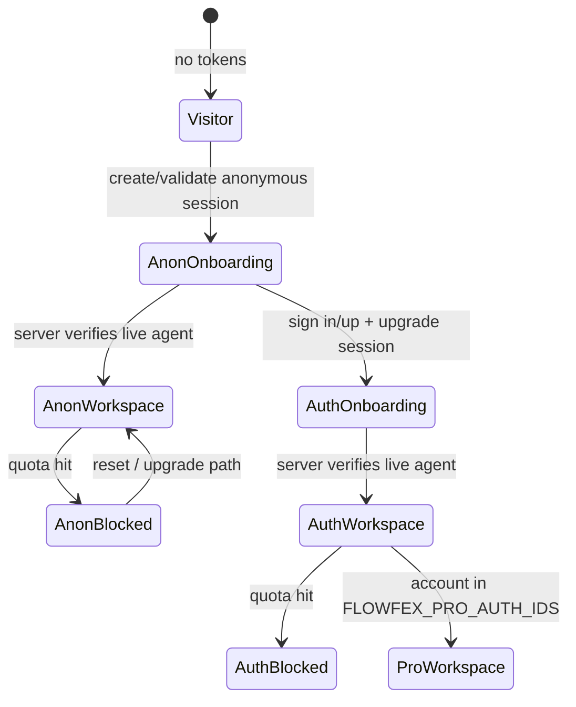

# Flowfex product state: identity, workspace, routing

This document is the **authoritative description** of how Flowfex separates **account identity** (Better Auth) from **workspace / orchestration state** (Neon `sessions` row + usage), how **routing** decisions are made, and how the **`GET /api/session/resolve-state`** snapshot ties them together.

---

## 1. Identity vs workspace

| Layer | Responsibility | Storage / transport |
|--------|----------------|---------------------|
| **Better Auth** | Account: email, OAuth, password reset, JWT access token | HTTP-only cookies + `Authorization: Bearer` from `getSession()` |
| **Flowfex session** | Workspace: graph, agents, execution pointer, anonymous token (until upgraded) | Postgres `sessions` table; anonymous token in `localStorage` + optional `fx_session` cookie |
| **Usage** | Quotas: skill/tool pulls, connections, duration windows | `usage_tracking` + policy in `UsageService` |

Anonymous **identity** is not a full user record: it is a **real persisted workspace** keyed by `anonymous_token` until upgrade attaches `auth_id`.

---

## 2. Product state machine (high level)

States are **combinations** of:

- **Auth**: none · anonymous-only · authenticated (+ optional **pro** tier via `FLOWFEX_PRO_AUTH_IDS`)
- **Workspace**: none · session exists
- **Agent (server)**: disconnected · **live connected** (recent `lastSeen` / `connectedAt` within server `LIVE_AGENT_PRESENCE_MS`, same rule as the browser)
- **Quota**: ok · blocked (`blockedLimit` / `connectionBlockedLimit` from usage)

**Legal transitions (events)**

| Event | Effect |
|--------|--------|
| First app load with no session | Create or validate anonymous session → **anonymous_onboarding** |
| Agent attach verified on server | **agentConnectedServer** true → workspace / dashboard allowed |
| Quota / connection cap | **quotaBlocksExecution**; dashboard may still render with overlay |
| Sign-in / sign-up + upgrade API | Same `sessions` row gains `auth_id`; graph preserved |
| Sign-out | Clear Better Auth + clear anonymous token; new anonymous path |
| Stale anonymous (idle, no agent, old `last_active_at`) | `lifecycle.clearAnonymousTokenSuggested` (UI may start fresh) |
| Session row missing / token invalid | **visitor** until new anonymous session |

---

## 3. Dashboard gating rules

1. **Server**: `agentConnectedServer` = at least one connected agent on the session row passes **server** `isLiveConnectedAgentServer` (mirrors frontend recency rule).
2. **Client**: Zustand + socket may update before the next resolve; `hasConnectedAgent` in `SessionContext` treats **server flag OR** live local/session agents as connected for UX.
3. **`RequireAttachedAgent`**: allows `/dashboard` when `sessionReady` and (**server agent** OR **client live agent** OR `hasConnectedAgent`), with a short grace window for hydration.
4. **Never** open the dashboard on “token exists alone”; **resolve-state** is the structured check; agent presence is explicit.

### `/app` marketing entry

Landing CTAs and in-page “open app” buttons use **`/app`**. The **`AppEntry`** route waits for `sessionReady`, runs **`refreshAppState()`** once if no snapshot is present yet, then redirects to **`/dashboard`** when **`gates.allowDashboard`** is true (server-verified live agent), otherwise **`/onboarding`**. Sign-in / sign-up success paths still navigate to **`/onboarding`** so connecting an agent stays the explicit next step after auth.

---

## 4. Upgrade and quota rules

- **Upgrade**: `POST /api/session/upgrade` with Bearer + anonymous token; server sets `auth_id`, stamps `authUpgradeAt` in graph metadata, clears conflicting ownership.
- **Quota**: Enforced in `UsageService` / skill-tool endpoints; anonymous vs authenticated vs **pro** tiers use `FLOWFEX_LIMITS` (`pro` is selected when `auth_id` is listed in `FLOWFEX_PRO_AUTH_IDS`).
- **Resolve payload** embeds the same **`usage`** object as `GET /api/session/usage` so the UI can trust one round-trip on boot.

---

## 5. Security rules

- **resolve-state** with Bearer: primary workspace = **most recent session for that `auth_id`**.
- If a browser still holds an **anonymous** token while signed in, an **unclaimed** anonymous session is **not** merged into the authenticated view (prevents cross-account workspace bleed).
- Anonymous-only tokens cannot read sessions that already belong to another `auth_id` (handled in resolution + existing upgrade ownership checks).
- Usage and session ownership checks remain on existing `/api/session/usage` and connect paths.

---

## 6. API: `GET /api/session/resolve-state`

Returns a single JSON document including:

- `productMode` — e.g. `visitor`, `anonymous_onboarding`, `anonymous_workspace`, `anonymous_blocked`, `authenticated_onboarding`, `authenticated_workspace`, `authenticated_blocked`, `pro_*`.
- `gates.allowDashboard` — true only when **server** sees a live agent (orchestration entry still subject to quota overlay).
- `gates.quotaBlocksExecution` — from usage blocked flags.
- `lifecycle` — stale / expiry hints for anonymous cleanup UX.
- `usage` — full usage snapshot when a session exists.

The React app calls this during **`SessionProvider.initialize()`** and exposes **`refreshAppState()`** after connect.

---

## 7. Tests

See `backend/src/__tests__/app-state-resolution.test.js` for deterministic transitions on mocked services.
